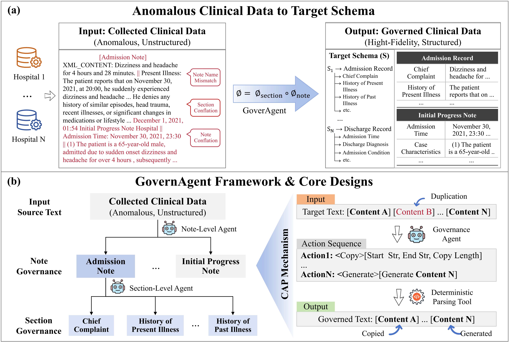

# An Efficient and Reliable Agent-Based System for Clinical Data Governance

This repository contains the inference and evaluation scripts used for clinical note governance experiments.



## 0. Environment Requirements

### Runtime

- Python `>=3.10`
- Linux recommended for vLLM serving
- NVIDIA GPU + CUDA (required for vLLM inference)

### Python Packages

Install minimal dependencies:

```bash
pip install vllm openai transformers tqdm jieba
```

If you only run local evaluation scripts (`2-1-*`, `2-2-*`) without model inference, standard library is mostly sufficient.

## 1. Predefined Interface Schemas

| Note Type | Required Sections |
| :--- | :--- |
| Admission Record | Admission Time, Chief Complaint, History of Present Illness, History of Past Illness, Specialist Examination, Social History, Menstrual History, History of Family Member Diseases, Physical Examination, Auxiliary Examination, Preliminary Diagnosis, Admission Diagnosis, Treatment Plan |
| Initial Progress Note | Diagnostic Criteria, Preliminary Diagnosis, Differential Diagnosis, Treatment Plan, **Case Characteristics** |
| Daily Progress Note | Daily Situations, Daily Orders, Treatment Plan |
| Consultation Record | Admission Diagnosis, Current Diagnosis, Hospital Course, Auxiliary Examination, Reason for Consultation, Treatment Plan, Consultation Opinions, **Consultation Time** |
| Surgical Record | Surgical Time, Preoperative Diagnosis, Postoperative Diagnosis, Surgical Procedure Name, Anesthesia Method, Intraoperative Medications, Intraoperative Course, **Surgical Grade** |
| Postoperative Note | Surgical Procedure Name, Postoperative Diagnosis, Surgical Time, Intraoperative Course, Postoperative Precautions, **Preoperative Diagnosis** |
| Discharge Record | Admission Time, Discharge Time, Admission Diagnosis, Discharge Diagnosis, Admission Condition, Treatment Course, Discharge Orders, **Discharge Condition** |
| Death Record | Admission Time, Death Time, Admission Diagnosis, Treatment Course, Cause of Death, Death Diagnosis, **Admission Condition** |

## 2. Repository Layout (Top-Level)

All main scripts are placed at repository root for easy reproduction:

- Inference (agent): `1-2-new-agent.py`, `1-2-new-agent-en.py`
- Inference (flat): `1-1-new-flat.py`, `1-1-new-flat-en.py`
- Evaluation: `2-1-f1-soft.py`, `2-1-f1-soft-en.py`, `2-2-f1-hard.py`, `2-2-f1-hard-en.py`
- Configs and prompts: `configs/`, `prompt_temp.py`
- Data examples: `datas/`

## 3. Quick Start

### Step 1: Start Model Service

Start your vLLM/OpenAI-compatible endpoint first, then set model name and URL in the target script.

### Step 2: Run Inference

From repository root:

```bash
python 1-2-new-agent.py
```

or

```bash
python 1-1-new-flat.py
```

### Step 3: Run Evaluation

```bash
python 2-1-f1-soft.py
python 2-2-f1-hard.py
```

## 4. Notes for Reproducibility

- Keep script files at repository root as provided.
- Keep prompt/config files unchanged to ensure consistent experimental behavior.
- Inference and evaluation scripts assume JSON/JSONL input formats used in this repository.

## 5. Typical Error Examples

The following are representative error cases observed by the system.

| Module | Category | Example | Interpretation |
| :--- | :--- | :--- | :--- |
| Note Governance | Unrecognized Note | Label: {"Daily Progress Note": "This afternoon, under endotracheal anesthesia, a living donor kidney transplantation was performed... Maintain water and electrolyte balance. "} Prediction: {"Daily Progress Note": "No relevant information extracted"} | The original text contains a daily progress note. However, it cannot be identified when the text style significantly deviates from the standard format of common daily progress notes (this note contains a large number of descriptions related to the surgical process). |
| Note Governance | Incomplete Note Recognition | Label: {"Initial Postoperative Note": "Initial Postoperative Note April 16, 2022, The patient's vital signs are stable ... the limbs can move freely. Signature: 2022-04-16"} Prediction: {"Initial Postoperative Note": "Initial Postoperative Note April 16, 2022, The patient's vital signs are stable ....At 16:00"} | Multiple parts of the text are extremely similar to the actual ending position of the target segment. This will cause the model to incorrectly predict the copy ending position (for example, "2022-04-16" and "At 16:00" here). |
| Section Governance | Unrecognized Section | Context: "...after confirming no infection or history of allergies, 2% lidocaine was administered locally. No significant pain or discomfort was observed..." Label: {"Anesthesia Method": "2% lidocaine was administered locally"} Prediction: {"Anesthesia Method": "No relevant information extracted"} | The text does not include clear lead words; the judgment relies on background knowledge. The model may lack such knowledge or fail to activate it. |
| Section Governance | Incomplete Section Recognition | Label: {"Differential Diagnosis": "Differential Diagnosis 1. Concussion:... not consistent with this case. 2. Brain contusion and laceration... not consistent with this case. 3. Meniere's disease... not consistent with this case"} Prediction: {"Differential Diagnosis": "Differential Diagnosis 1. Concussion:... not consistent with this case."} | Multiple portions of the text are very similar to the actual copy boundary, which leads the model to predict an incorrect termination copy position.(e.g. not consistent with this case. ) |
| Section Governance | Section Contains Extra Content | Label: {"Admission Condition": "And course of diagnosis and treatment: The patient... slight edema in both lower limbs, tenderness in both feet."} Prediction: {"Admission Condition": "And course of diagnosis and treatment: The patient... slight edema in both lower limbs, tenderness in both feet. Admission auxiliary examination: On 2018-08-10, outpatient bilateral lower limb vascular Doppler ultrasound:..."} | In the standard interface, "Admission Condition" and "Admission Auxiliary Examination" are separate fields. The model's semantic understanding of field boundaries is incorrect, leading to extra content in the predicted field. |

## 6. Extraction Instruction Templates

### Note Agent

```text
Note Agent:
You are a medical-record section splitting agent responsible for dividing messy clinical documents into independent sections.
Given a medical record that may contain one or multiple sections, extract the "{}" section from the following record according to clinical writing conventions: {}.

Please follow these rules during extraction:
(1) Use the actions "Copy" and "Generate" to extract section content.
    - "Copy" means you must issue a copy command and provide "copy start string", "copy end string", and "copy length" to extract part of the section.
    - The copy start/end strings are the section boundary markers and usually contain 5-8 characters. The copy length is the number of characters between start and end.
    - If you need to skip some content, stop copying at the skip position, then find a new copy start position and issue another copy command with parameters.
    - If the content to be copied is short (less than 20 tokens), use the "Generate" action, directly output the target content, and do not repeat content across actions.
    - If the target section appears multiple times with duplicate content, only extract the most complete version.
(2) Output the copy/generate process in the following format:
```json[{"action1": "Copy", "copy_start": "_", "copy_end": "_", "copy_length": "_"},
{"action2": "Generate", "content": "_"},
{"action3": "Copy", "copy_start": "_", "copy_end": "_", "copy_length": "_"}, ...]```
(3) If the target section does not exist in the medical record, return:
```json[{"action1": "Generate", "content": "未抽取到相关内容"}]```

Medical record text:
{}
```

### Section Agent

```text
Section Agent:
You are a medical-record field extraction agent. Please complete the following task.
Extract the content of the "{}" field from the "{}" medical record, where "{}" refers to "{}".

Please follow these rules during extraction:
(1) Use the actions "Copy" and "Generate" to extract field content.
    - "Copy" means you must issue a copy command and provide "copy start string", "copy end string", and "copy length" to extract part of the field.
    - The copy start/end strings are field boundary markers and usually contain 5-8 characters. The copy length is the number of characters between start and end.
    - If you need to skip some content, stop copying at the skip position, then find a new copy start position and issue another copy command with parameters.
    - If the content to be copied is short (less than 20 tokens), use the "Generate" action, directly output the target content, and do not repeat content across actions.
    - If the target field appears multiple times with duplicate content, only extract the most complete version.
(2) Output the copy/generate process in the following format:
```json[{"action1": "Copy", "copy_start": "_", "copy_end": "_", "copy_length": "_"},
{"action2": "Generate", "content": "_"},
{"action3": "Copy", "copy_start": "_", "copy_end": "_", "copy_length": "_"}, ...]```
(3) If the target field does not exist in the medical record, return:
```json[{"action1": "Generate", "content": "未抽取到相关内容"}]```

Medical record text:
{}
```

### Flat

```text
Flat:
You are a medical record field extraction agent. Please complete the following task.

Extract the content of the "{}" field from the medical record within "{}". "{}" refers to "{}".
Please pay attention to the following points during extraction:

(1) If the field content appears repeatedly, extract it only once.
(2) Do not extract garbled parts in the medical record.
(3) If the content to be extracted is not continuous, ensure the extracted content is complete, and connect discontinuous parts with "##". Retain keywords such as "gender" and "age".
(4) Extract in the following format: ```json[{"field_name": "_", "field_content": "_"}]```.
(5) If the required field does not exist in the medical record text, fill in "未抽取到相关内容" (content not found) in the "field_content" section.

Medical record text:
{}
```
